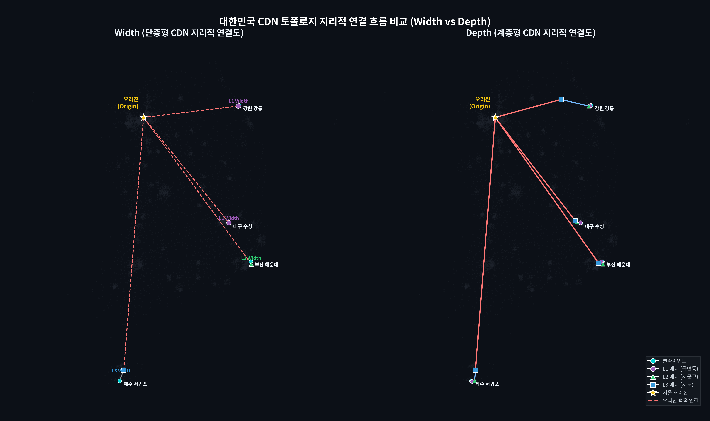
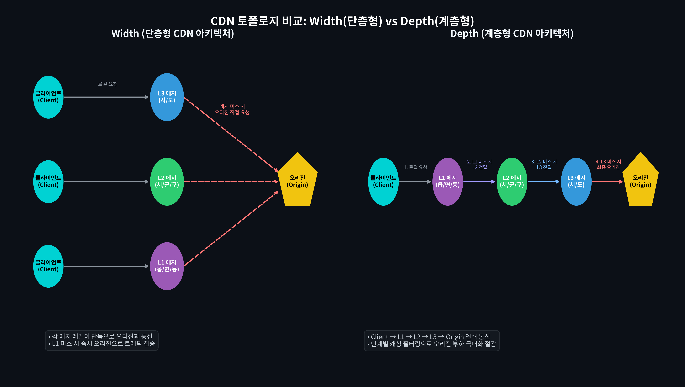
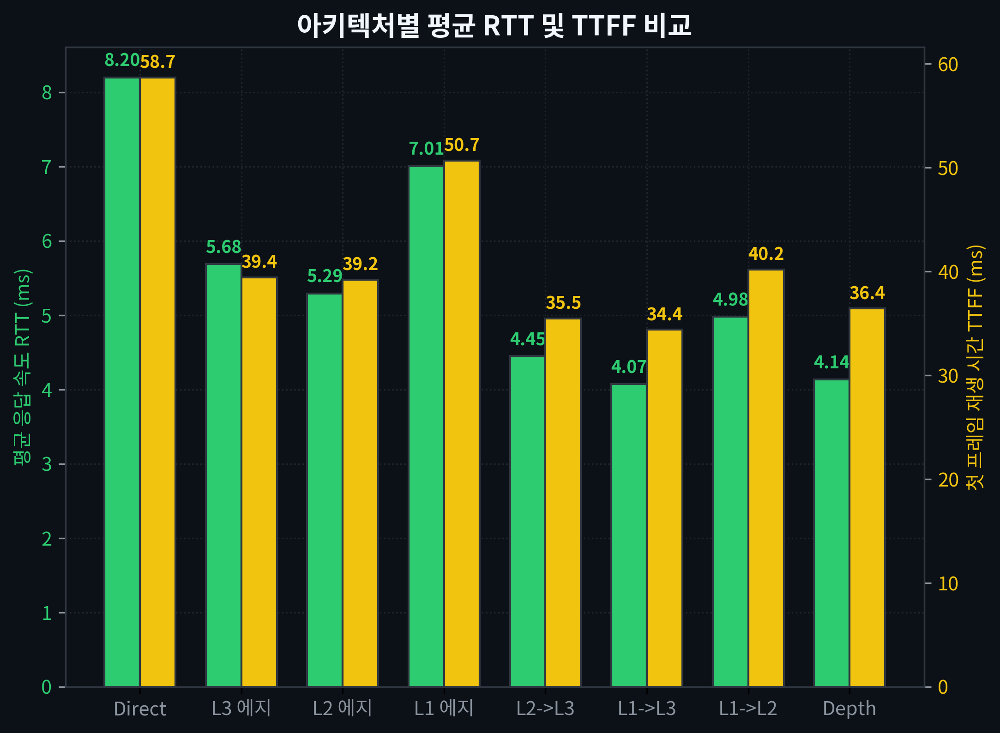
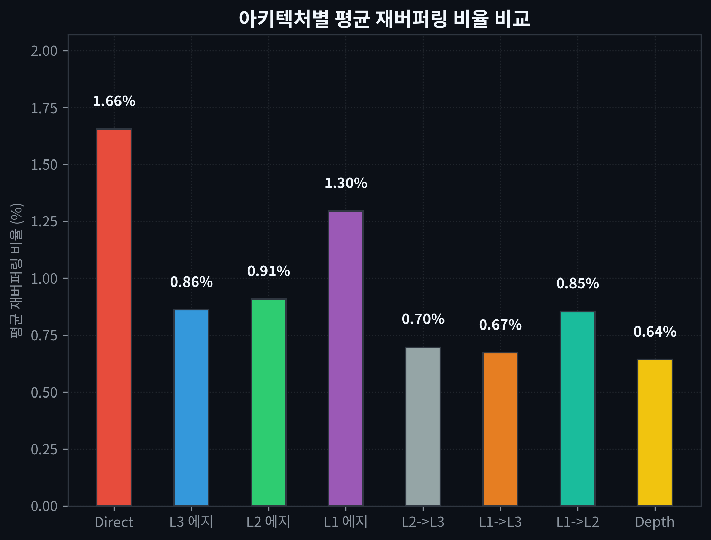
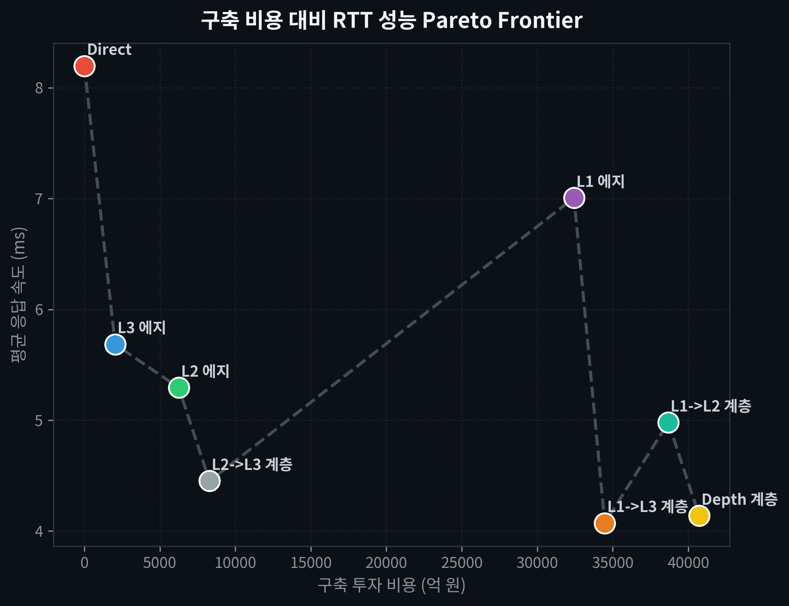

# South Korea Hierarchical CDN Video QoS Simulator
> 대한민국 행정구역(L3 시/도, L2 시/군/구, L1 읍/면/동) 구조를 기반으로 한 비디오 스트리밍 QoS 성능 실증 시뮬레이터 및 인터랙티브 웹 대시보드 프로젝트입니다.

### 🔗 실시간 대화형 지도 실증 링크 (Live Demo)
본 프로젝트의 시뮬레이션 결과 및 지리적 연결 흐름은 아래 GitHub Pages 링크에서 웹 브라우저를 통해 실시간으로 확인하실 수 있습니다:
👉 **[https://donghwicho.github.io/CDN-Simulation/](https://donghwicho.github.io/CDN-Simulation/)**

---

## 1. 프로젝트 개요 (Overview)

본 프로젝트는 대한민국의 실제 3단계 행정구역 분류 체계를 반영하여 전국적인 분산 에지 CDN 인프라의 성능적 가치를 수학적·네트워크 공학적으로 모델링하고 분석합니다. 단순 핑(RTT) 지연시간뿐만 아니라, 고화질 동영상 스트리밍 서비스에 필수적인 **TTFF(Time to First Frame)**, **재버퍼링 비율(Re-buffering Ratio)**, **오리진 부하 절감률(Origin Offload Rate)** 등의 3대 비디오 QoS 지표를 종합 분석합니다.

또한, **Width(단층 단일 계층 확장)** 구조와 **Depth(다계층 계층 연쇄)** 구조의 ROI(투자 대비 효율성) 효율을 파레토 프런티어(Pareto Frontier) 모델로 나타내고, 이 결과를 브라우저에서 직관적으로 탐색할 수 있는 **Leaflet.js 기반의 한/영 실시간 다국어 대시보드 지도** 및 **개별 이미지 시각화 결과물**을 제공합니다.

---

## 2. 주요 기능 및 특징 (Key Features)

1. **실제 행정동 데이터 100% 매핑 (6,487개 L1 거점)**
   * `korean-geocoding` 데이터베이스 기반으로 대한민국 전역 17개 광역자치단체(L3), 250개 기초자치단체(L2), 6,487개 읍면동(L1) 좌표망을 누락 없이 구축했습니다.
   * 여주시 등 L2 좌표 결측 지역 및 회현동 등 25개 L1 좌표 결측 지역에 대해 인접 법정동 매핑 및 부모 편차 지터링 Fallback 처리를 적용하여 지리 망상을 완벽하게 복원했습니다.
2. **Client-Server 지터링 오버랩 개선**
   * 에지 서버와 클라이언트가 완전히 동일 위치로 찍혀 식별하기 어려운 오버랩 현상을 해결하고자 **1.2km ~ 2.2km의 무작위 거리 지터링 오프셋**을 적용하여 경로선 시각화 완성도를 높였습니다.
3. **비디오 스트리밍 QoS 수학적 모델링**
   * **RTT**: 하위 에지 센터 연결 거리 및 백홀 대역폭, 혼잡도를 조합한 물리 전송 지연 모델.
   * **TTFF (첫 프레임 재생 시간)**: TCP/TLS 핸드셰이크 및 매니페스트 초기 세그먼트 전달 지연($3.5 \times RTT + Server\_Delay$).
   * **재버퍼링 비율**: 패킷 RTT 편차와 비디오 비트레이트 처리에 기반한 스트리밍 중단 비율 ($Base\_Rate + 0.08 \times RTT$).
   * **오리진 부하 절감률**: 에지 노드별 LRU 캐시(L1: 1%, L2: 6%, L3: 30%) 적중 및 다단계 필터링(Depth)에 따른 오리진 대역폭 감소 비율.
4. **인터랙티브 웹 대시보드 (Leaflet.js)**
   * HTML 대시보드는 리로드 없이 **실시간 KO/EN 다국어 텍스트 및 범례 토글**이 가능합니다.
   * 13,000개 이상의 마커와 경로선 렌더링 성능 최적화를 위해 **Leaflet Canvas Renderer**를 도입했습니다.
   * Depth 모드 선택 시 사용자 $\rightarrow$ L1 $\rightarrow$ L2 $\rightarrow$ L3 $\rightarrow$ Origin으로 이어지는 다단계 연결 홉(Hop) 경로선을 실시간 폴리라인으로 가시화합니다.
5. **개별 이미지 분할 제공**
   * 논문 및 학술 보고서 작성을 위해 모든 종합 맵과 결과 그래프를 단일 이미지(1 Figure, 1 Plot) 형태로 한글/영어 버전으로 분할 생성합니다.

---

## 3. 기술 스택 (Tech Stack)

* **Language**: Python 3.x
* **Mathematical Operations**: NumPy, OrderedDict (Zipf 분포 시뮬레이션 및 LRU 캐시 구조)
* **Visualization (Matplotlib)**: Headless Agg 백엔드를 사용하여 300 DPI 초고해상도 다국어 플롯 및 지도 생성
* **Geocoding**: `korean-geocoding` (대한민국 행정구역 좌표 조회 라이브러리)
* **Frontend**: Vanilla HTML5, CSS3, Leaflet.js (Interactive Mapping Library), Canvas Renderer

---

## 4. 파일 구조 및 설명 (Project Structure)

```bash
/home/donghwi/cloud_network_project
├── README.md                              # 프로젝트 설명 파일 (본 파일)
├── generate_korea_cdn_map.py              # 시뮬레이션 실행, Matplotlib 종합/개별 이미지 생성 및 Leaflet.js 대시보드(HTML) 파일 생성 메인 스크립트
├── korea_cdn_simulation.py                # 시뮬레이션 실행 및 종합/개별 이미지 결과 플로팅용 서브 스크립트
├── generate_architecture_diagram.py       # Width vs Depth CDN 연결 토폴로지의 논리적 개념 설계도를 렌더링하는 스크립트
├── generate_map_topology_diagram.py       # 대한민국 실제 지도(행정동 실루엣) 위에 각 토폴로지 연결 선을 투영하여 시각화하는 스크립트
├── korea_cdn_interactive_map.html         # Leaflet.js 기반 한/영 실시간 다국어 전환 지원 인터랙티브 지도 대시보드
├── korea_cdn_map.png                      # 종합 지오 토폴로지 지리 성능 맵 (대표-한글판)
├── korea_cdn_result.png                   # 종합 성능 비교 결과 4분할 그래프 (대표-한글판)
├── Cloud_Networking_Final_Report          # 영어/한국어 실증 논문 LaTeX 프로젝트 폴더 (IEEE Template 적용)
│   ├── IEEE-conference-template-062824.tex # 영어 실증 논문 소스 파일 (시뮬레이션 전용)
│   ├── IEEE-conference-template-062824_ko.tex # 한국어 실증 논문 소스 파일 (시뮬레이션 전용)
│   ├── IEEEtran.cls                        # IEEE LaTeX 클래스 파일
│   └── [png_files]                         # 논문에 포함된 영문 고해상도 시각화 차트들
├── korea_cdn_map_[strat]_[lang].png      # 각 레벨별(direct, l1, l2, l3, depth, pareto) 분할 단독 지도 이미지 (ko/en 지원)
├── korea_cdn_result_[metric]_[lang].png   # 각 결과 지표별(rtt_ttff, hit_offload, rebuffering, regional_rebuff) 분할 단독 그래프 이미지 (ko/en 지원)
├── korea_cdn_topology_[lang].png         # CDN 논리 구조 개념도 이미지 (ko/en 지원)
└── korea_cdn_map_topology_[lang].png     # 대한민국 지도 위 실제 물리적 통신 홉 매핑 구조도 이미지 (ko/en 지원)
```

---

## 5. 실행 방법 (How to Run)

콘솔(Conda 환경 포함)에서 아래 명령어를 실행하여 시뮬레이션을 수행하고 모든 시각화 파일들을 실시간 컴파일할 수 있습니다:

### 메인 시뮬레이션 및 웹 대시보드 생성
```bash
python3 generate_korea_cdn_map.py
```
* 위 명령을 실행하면 `100,000건`의 Zipf 기반 콘텐츠 요청 캐시 시뮬레이션이 돌아가며, 완료 후 `korea_cdn_interactive_map.html` 웹 파일 및 종합/개별 성능 지도와 결과 그래프들이 `/home/donghwi/cloud_network_project` 경로에 자동 생성되고 아티팩트 보관함으로 복사됩니다.

### 통계 결과 그래프 시각화 (Matplotlib 전용)
```bash
python3 korea_cdn_simulation.py
```

### CDN 논리 토폴로지 연결도 생성
```bash
python3 generate_architecture_diagram.py
```

### 대한민국 실제 지도 위 통신 홉 경로 매핑 이미지 생성
```bash
python3 generate_map_topology_diagram.py
```

---

## 6. 시뮬레이션 주요 결과 요약 (Key Results)

| 구축 레벨 (전략) | 총 노드 수 | 평균 RTT (ms) | 평균 TTFF (ms) | 평균 재버퍼링 비율 (%) | 오리진 부하 절감률 (%) | 구축 비용 (가상 단위) |
| :--- | :---: | :---: | :---: | :---: | :---: | :---: |
| **오리진 직접 연결 (No CDN)** | 0개 | 8.20 ms | 58.7 ms | 1.66 % | 0.00 % | 0억 원 |
| **L3 에지 (시/도 단위 - Width)** | 17개 | 5.68 ms | 39.4 ms | 0.86 % | 84.82 % | 2,040억 원 |
| **L2 에지 (시/군/구 단위 - Width)** | 250개 | 5.29 ms | 39.2 ms | 0.91 % | 64.34 % | 6,250억 원 |
| **L1 에지 (읍/면/동 단위 - Width)** | 6,487개 | 7.01 ms | 50.7 ms | 1.30 % | 29.41 % | 32,435억 원 |
| **계층형 멀티티어 CDN (Depth)** | **6,754개** | **4.14 ms** | **36.4 ms** | **0.64 %** | **84.83 %** | **40,725억 원** |

### 💡 주요 시각화 결과 이미지 (Visualization Results)

#### ① 대한민국 지도 위 실제 물리적 통신 홉 매핑 (Width vs Depth)


#### ② CDN 논리 토폴로지 연결 구조도


#### ③ 아키텍처별 RTT 및 TTFF 비교 그래프


#### ④ 아키텍처별 평균 비디오 재버퍼링 비율 비교 그래프


#### ⑤ 투자 비용 대비 RTT 성능 파레토 프런티어 곡선 (Pareto Frontier)


---

### 📂 주요 시각화 이미지 파일 목록 및 상대 경로
*   **실시간 웹 대시보드 파일**: [korea_cdn_interactive_map.html](./korea_cdn_interactive_map.html)
*   **지리적 통신 홉 매핑 (한/영)**: [korea_cdn_map_topology_ko.png](./korea_cdn_map_topology_ko.png) | [korea_cdn_map_topology_en.png](./korea_cdn_map_topology_en.png)
*   **CDN 논리 구조 개념도 (한/영)**: [korea_cdn_topology_ko.png](./korea_cdn_topology_ko.png) | [korea_cdn_topology_en.png](./korea_cdn_topology_en.png)
*   **비용 대비 RTT 파레토 프런티어 (한/영)**: [korea_cdn_map_pareto_ko.png](./korea_cdn_map_pareto_ko.png) | [korea_cdn_map_pareto_en.png](./korea_cdn_map_pareto_en.png)
*   **평균 RTT 및 TTFF 비교 (한/영)**: [korea_cdn_result_rtt_ttff_ko.png](./korea_cdn_result_rtt_ttff_ko.png) | [korea_cdn_result_rtt_ttff_en.png](./korea_cdn_result_rtt_ttff_en.png)
*   **캐시 적중 및 오리진 부하 절감 (한/영)**: [korea_cdn_result_hit_offload_ko.png](./korea_cdn_result_hit_offload_ko.png) | [korea_cdn_result_hit_offload_en.png](./korea_cdn_result_hit_offload_en.png)
*   **평균 재버퍼링 비율 (한/영)**: [korea_cdn_result_rebuffering_ko.png](./korea_cdn_result_rebuffering_ko.png) | [korea_cdn_result_rebuffering_en.png](./korea_cdn_result_rebuffering_en.png)
*   **거점 지역별 재버퍼링 비율 (한/영)**: [korea_cdn_result_regional_rebuff_ko.png](./korea_cdn_result_regional_rebuff_ko.png) | [korea_cdn_result_regional_rebuff_en.png](./korea_cdn_result_regional_rebuff_en.png)
